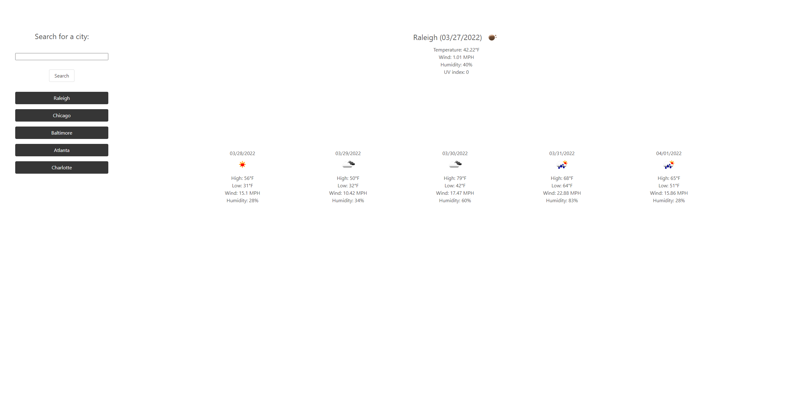

# Challenge 6

# Weather Dashboard by Mason Morris

The objective of this assignment was to create a weather dashboard which keeps a search history. I made said dashboard using HTML, CSS, JavaScript, JQuery, API calls, and Bulma for basic styling.

[CLick here to view the deployed page!](https://masontmorris.github.io/weather-dashboard/)
